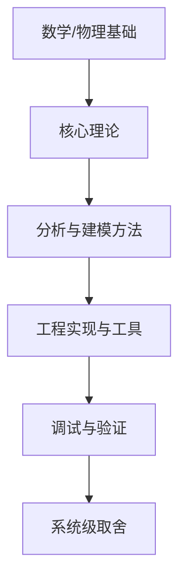

# 学科全景地图

## 步骤

### 1. 溯源定义
这门学科解决的**根本问题**是什么？一句话，禁止抄教材导言。
再给历史主线：为什么会出现 → 中间有哪几次范式变化 → **现在业界真正在用哪一支**。

### 2. 模块化（5-9 个，超了就是没抽象完）
每个模块一行：

```
模块名 | 解决什么问题 | 核心心智模型 | 学它的信号（什么时候必须学）| 权重
```

### 3. 依赖图（RikkaHub 支持 Mermaid 渲染）



必须标出**真依赖**与**伪依赖**（教材排在前面但其实可以后学的）。

### 4. 二八分析
标出 20% 撑起 80% 应用的内容 = 主干；其余标"按需查阅"，
并**明说跳过的风险**（"跳过它，你以后在 X 场景会栽跟头"）。

### 5. 地图边界
这门学科**不负责**什么；与相邻学科的分界线在哪；越界了该去哪门课找答案。

### 6. 常见错误地图
学校/网课的教学顺序 vs 工程实践顺序的差异；
哪些章节是"考试产物"而非"能力产物"（明确点名）。

## 输出格式
- 一句话本质
- 模块表（含权重）
- Mermaid 依赖图
- 主干路径（7 步以内，带每步预计耗时）
- 可延迟 / 可跳过清单（含跳过风险）
- 存档：写入 courses/<课程名>/map.md，并在图上标注用户当前位置

## 铁律
- **禁止照抄一本教材的目录当地图**。必须交叉至少 2 类来源：
  经典教材结构 + 从业者/老兵的实践顺序（可 use_skill veteran-scout 取材）。
- 每个模块必须写"学它的信号"，否则用户无法判断何时该学。
- 地图必须可更新：每次里程碑完成后回来标记进度。
- 不要输出超过 9 个模块；如果确实庞大，先切子领域再画。

## 完成判定
用户能凭记忆画出模块依赖图的主干（允许缺细节）。
